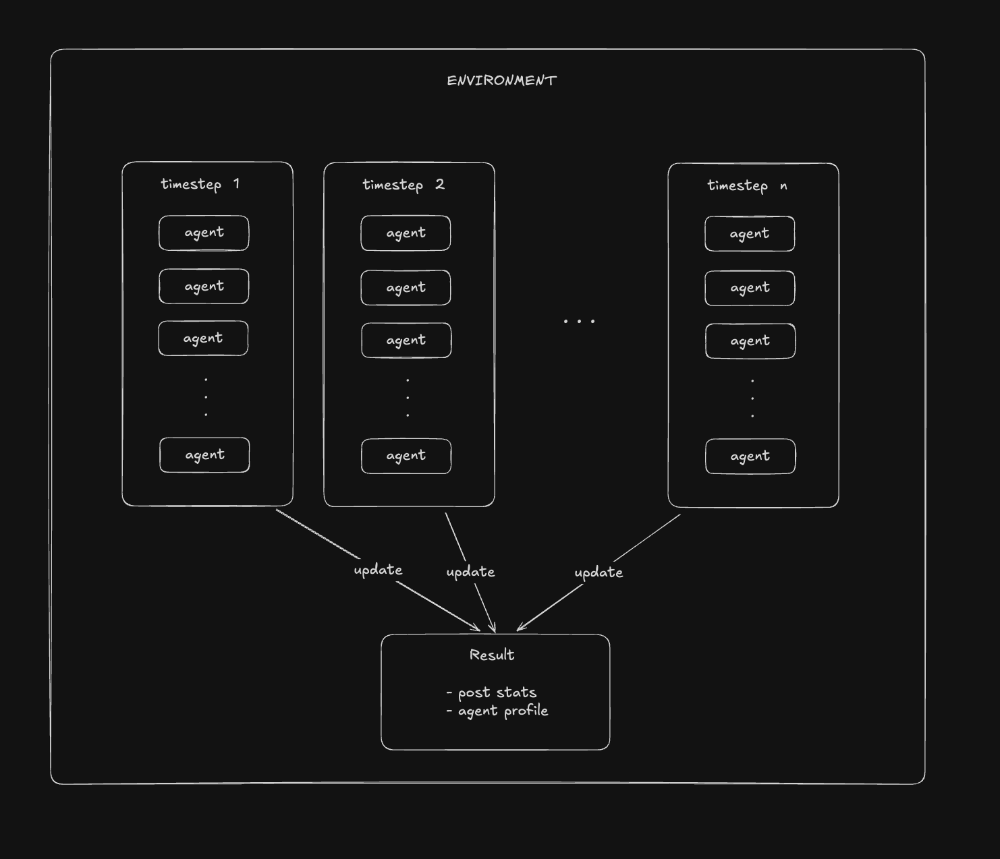
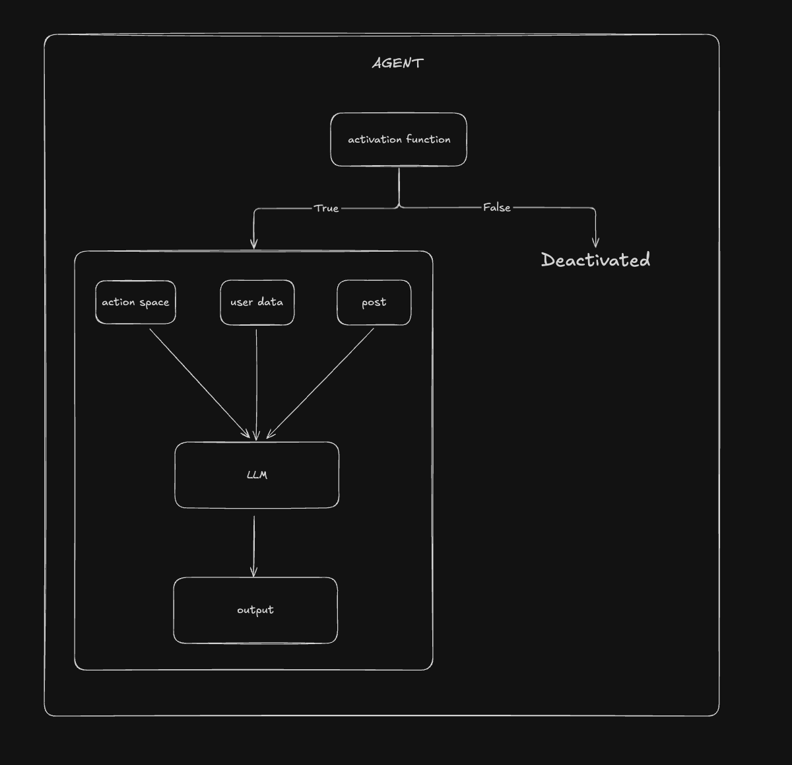

# HackerNews Simulation

This project presents a framework for using AI agents in simulating social media - HackerNews.

## Architecture Overview

### Environment

The environment functions as the orchestrator, coordinating all components within the simulation system. To accurately represent temporal dynamics inherent in real-world systems, we have implemented discrete timestep progression.

For each temporal iteration:
- Agent activation is determined by a probabilistic activation function
- Activated agents execute behavioral protocols
- All agent-environment interactions are recorded and system state is updated accordingly

### Agent

The agent is designed to emulate authentic user interaction patterns based on activity data. The activation function incorporates multiple parameters including post score and temporal variables to determine agent participation probability.

## Dataset
We use HackerNew's official API to gather user's real world activity data. Due to storage limit, datasets in this repo are truncated to first 1000 records. Full dataset is [available here](https://huggingface.co/datasets/dannylee1020/hackernews-simulation)

## Limitations
Some challenges we faced from building the simulations are:
- The simulation simplifies agent behavior compared to real HackerNews users
- Limited dataset size may not fully represent the diversity of real-world interactions
- Computational constraints restrict the scale and complexity of simulations
- Temporal dynamics may not capture long-term trends and evolving user behaviors
- Some social dynamics present in real platforms (like group formation) are not modeled
- Ranking algorithm we designed may not accurately reflect how HackerNews ranks the posts.

## Installation

Install requisite dependencies utilizing Poetry package management: `poetry install`

## How to run
Set OpenAI api key first:

`export OPENAI_API_KEY=<your-openai-api-key>`

Then run:

`sh run.sh`

from the root directory and access the visualization interface at `http://localhost:8501/`

## References

- [OASIS: Open Agent Social Interaction Simulations with One Million Agents](https://arxiv.org/abs/2411.11581)
- [Scaling Synthetic Data Creation with 1,000,000,000 Personas](https://arxiv.org/abs/2406.20094)
